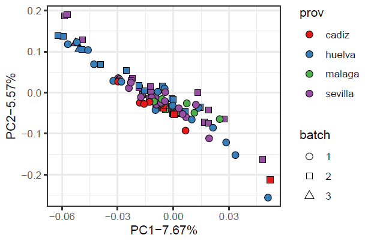
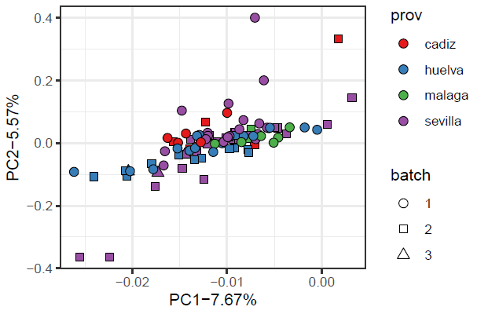
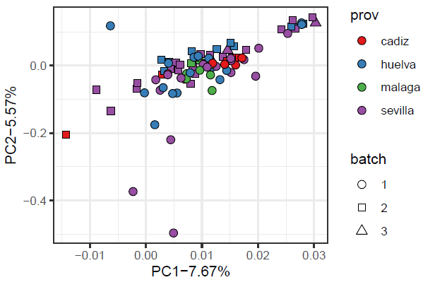
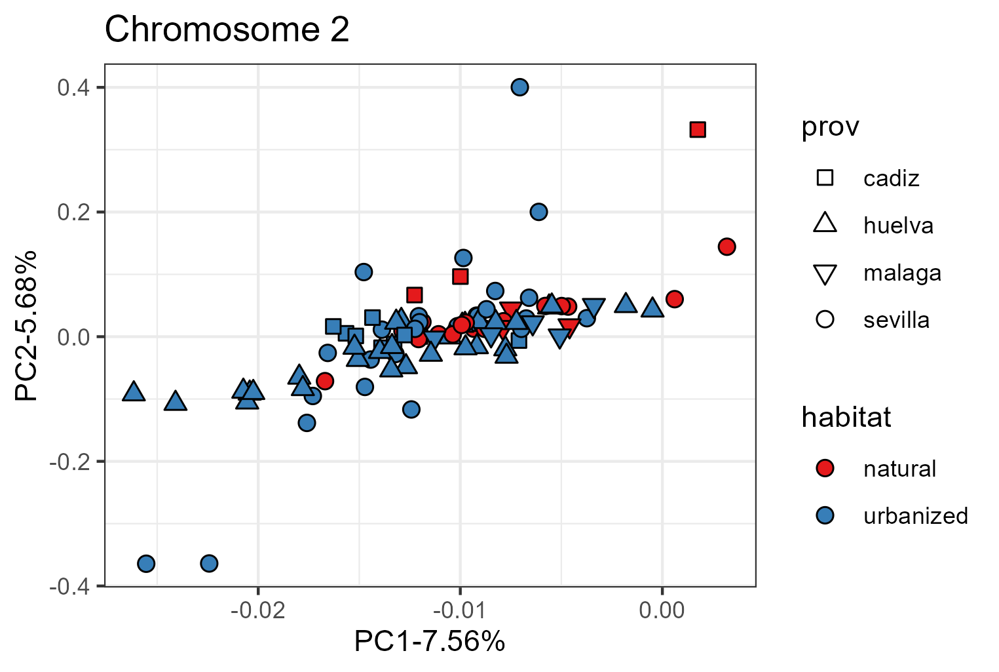
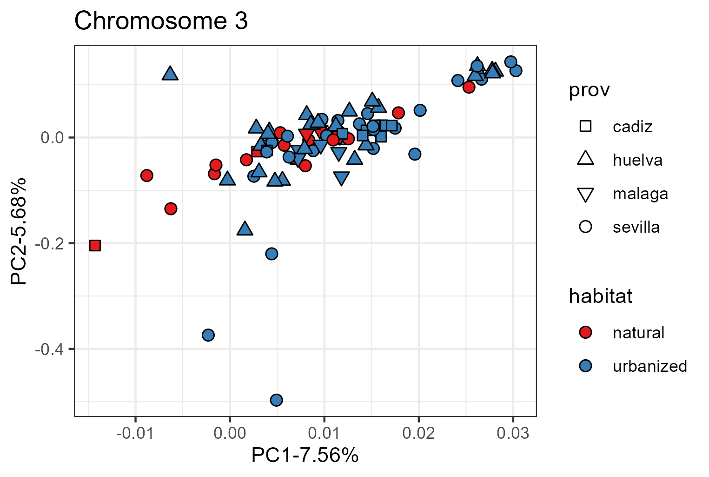
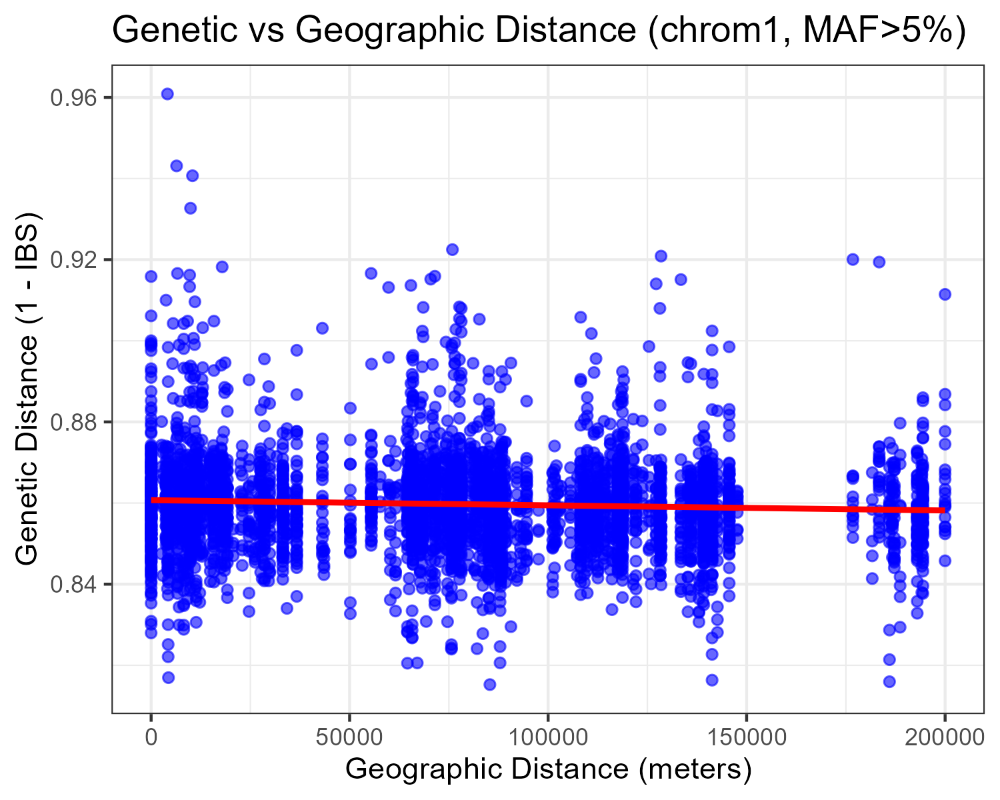
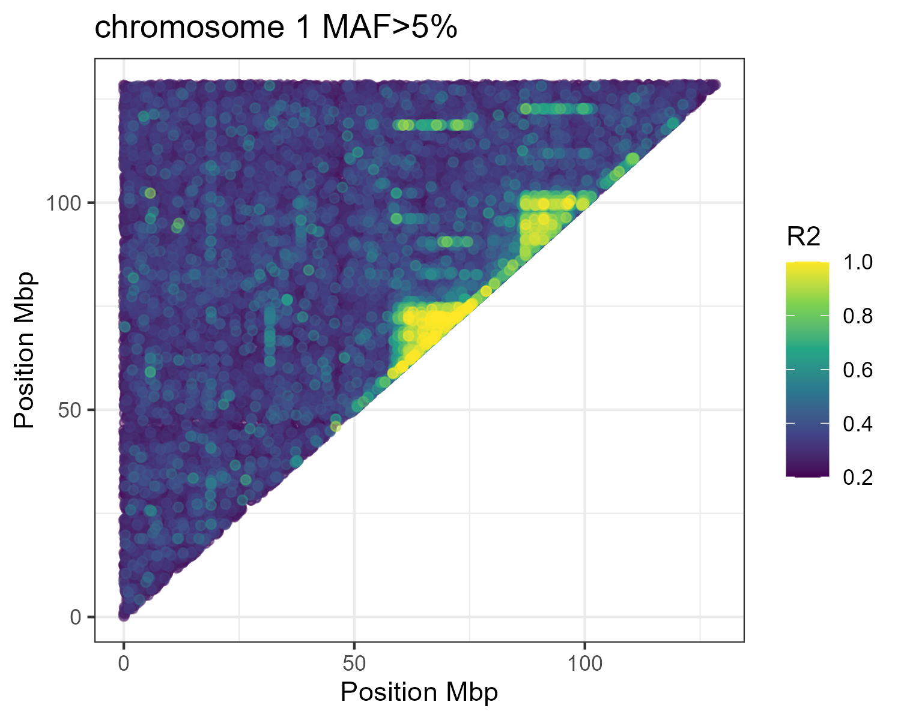
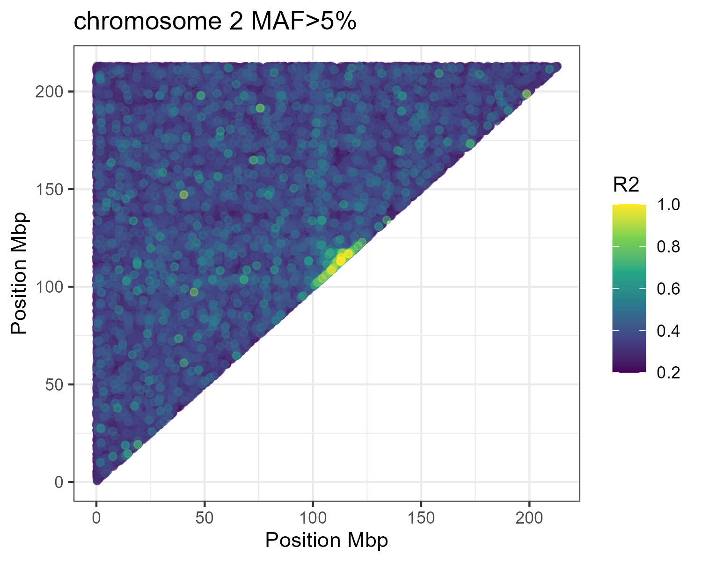

##January 2025

On 96 samples of Culex pipiens

cadiz	12 
huelva	33
malaga	8
sevilla	45

alamillo	    4
alamos	        7
benalup	        3
bollullos	    4
campillos	    3
canada	        2
cmutis	        6
colinaspinar	4
corrales	    4
dehesa	        4
edarhu	        8
edarmo	        2
fpiedra	        5
granjaescuela	4
hampa	        4
leandro	        7
palomares	    10
puebla	        1
rinconada	    3
vejer	        9

Using filters -- DP>2 GQ>20 MISS<20 MAC>2
* chrom1: 388317 sites
* chrom2: 543661 sites
* chrom3: 451723 sites

## Pca analysis 
Not including 1 sample form Celestino Mutis (Huelva) and 1 from Puebla (Seville) because they were outliers in all the PCAs. Not excluded from the PCA calculations, just from the graphs.

There is no cluster related to populations or sequencing batches.

There is no cluster related to urbanization level.

We cconfirmed that there is no correlation between geographic distance and genetic distance.

We checked linkage-desequilibrium along the genome:

